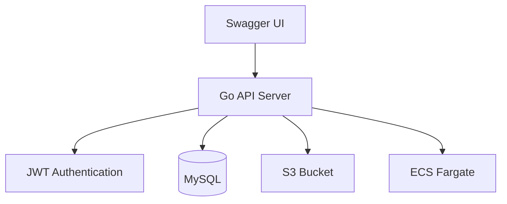
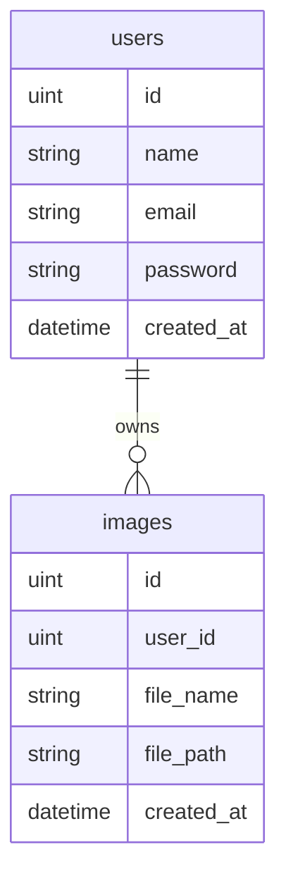
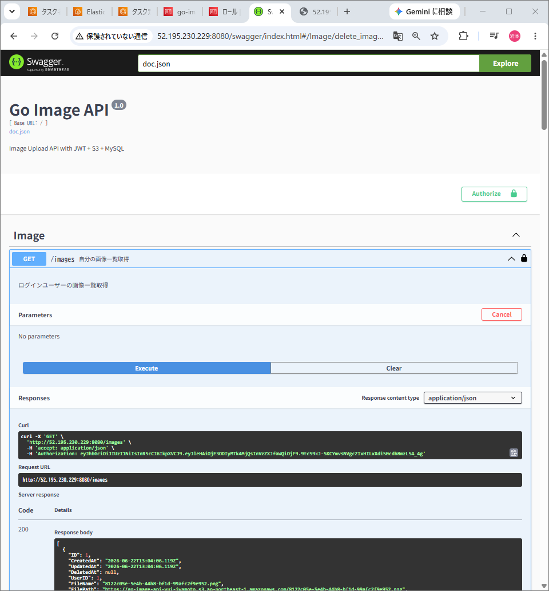
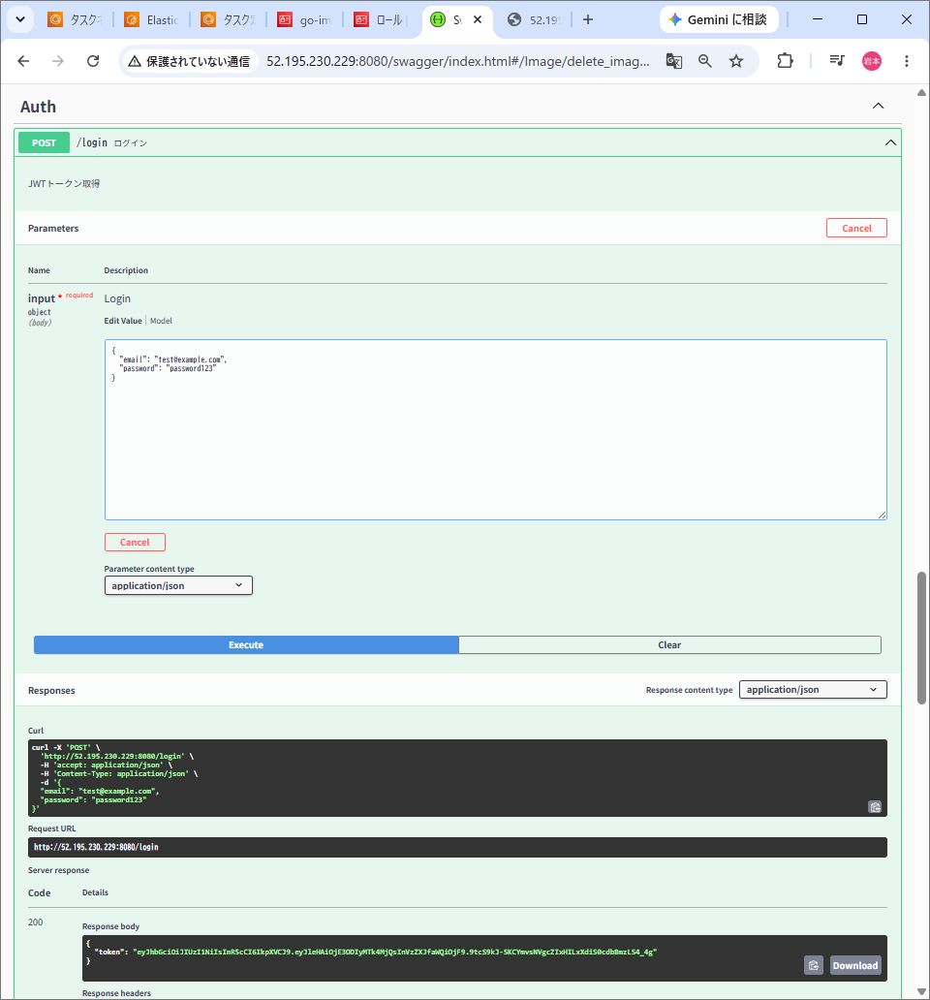
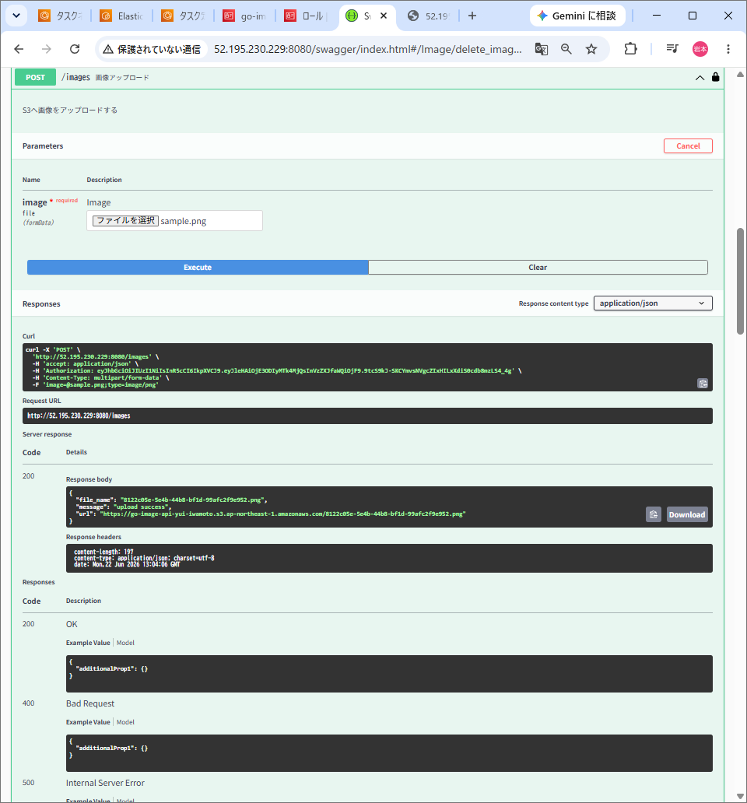
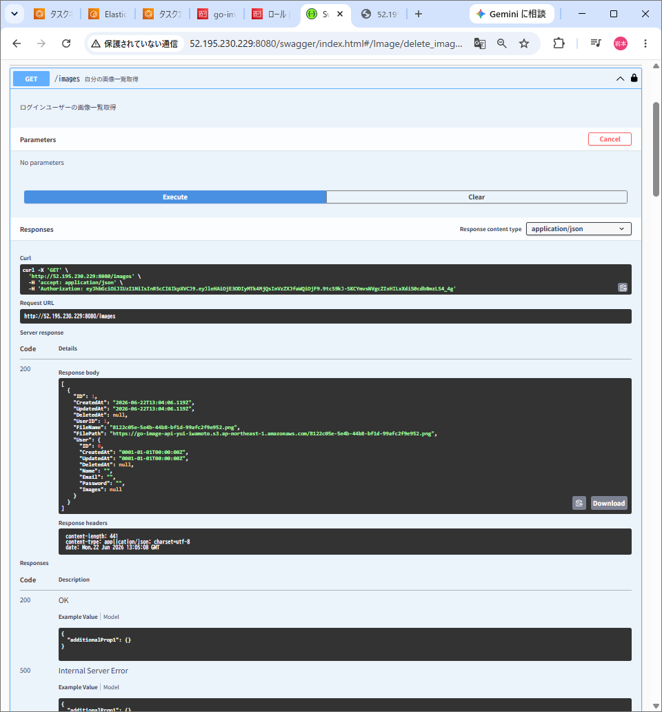
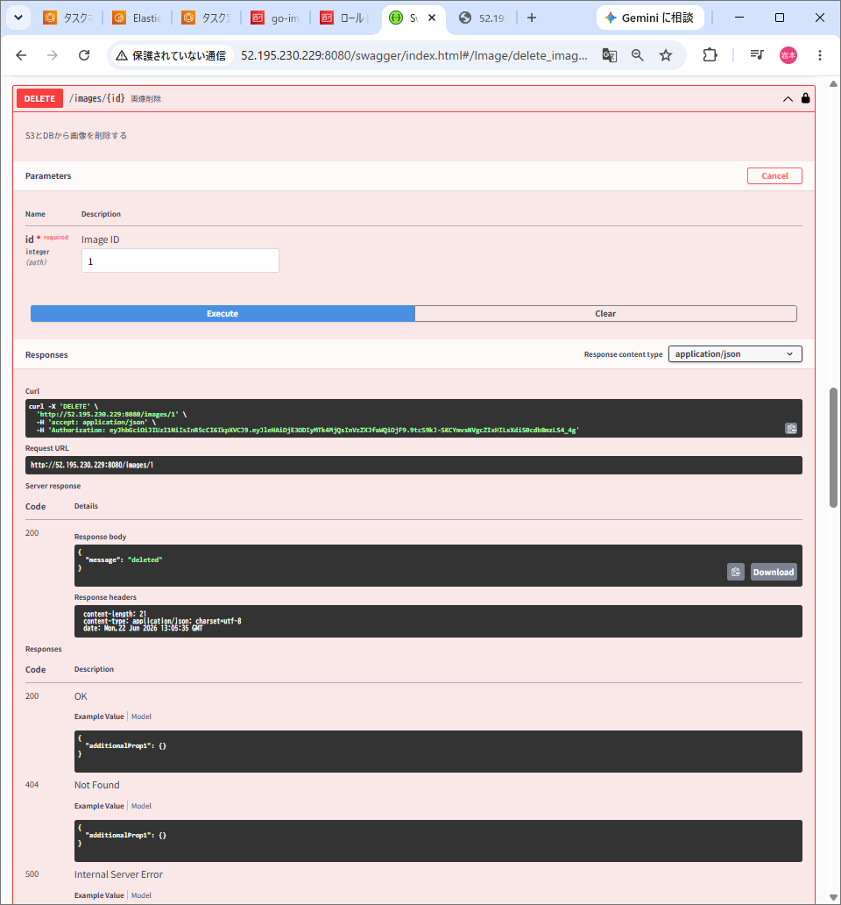
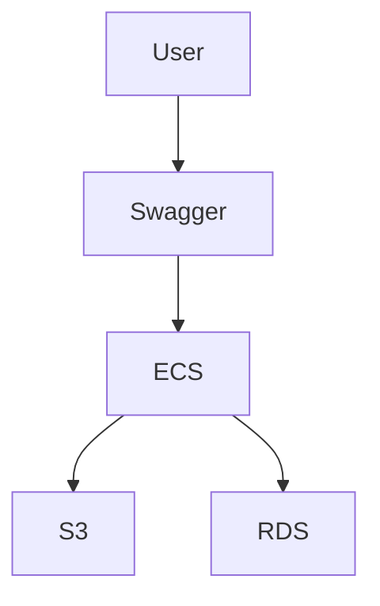

# Go Image API


---

# 概要

JWT認証を利用した画像管理APIです。

ログインしたユーザーのみ、

- 画像アップロード
- 画像一覧取得
- 画像削除

を実行できます。

アップロードされた画像はAWS S3へ保存し、
メタ情報はMySQLに保存しています。

Dockerによるコンテナ化を行い、
AWS ECS(Fargate)上へデプロイしています。

---

# 使用技術

| Category | Technology |
|------------|-----------|
| Language | Go 1.26 |
| Framework | Gin |
| Authentication | JWT |
| Database | MySQL |
| ORM | GORM |
| Storage | Amazon S3 |
| Container | Docker |
| Cloud | ECS(Fargate) |
| Documentation | Swagger |
| Version Control | Git / GitHub |

---

# システム構成図



---

# ER図



---

# API一覧

| Method | Endpoint | Description |
|----------|---------|------------|
| POST | /register | ユーザー登録 |
| POST | /login | JWT取得 |
| POST | /images | 画像アップロード |
| GET | /images | 画像一覧取得 |
| DELETE | /images/{id} | 画像削除 |

---

# ディレクトリ構成

```text
go-image-api
│
├── cmd
├── config
├── controllers
├── docs
├── dto
├── images
│   ├── swagger.png
│   ├── login.png
│   ├── upload.png
│   ├── get.png
│   └── delete.png
├── middleware
├── models
├── repositories
├── routes
├── services
├── uploads
├── utils
├── Dockerfile
├── docker-compose.yml
├── main.go
└── README.md
```

---

# Swagger UI

## Top



---

## JWTログイン

JWTトークンを発行します。



---

## S3画像アップロード

画像をS3へ保存し、URLをDBへ登録します。



---

## 画像一覧取得

ログインユーザーの画像一覧を取得します。



---

## 画像削除

S3とDBから画像を削除します。



---

# AWS構成図



---

# 工夫した点

### レイヤードアーキテクチャ

責務を分離するため、

- controllers
- services
- repositories
- models

に分割し保守性を高めました。

---

### JWT認証

ログインユーザーのみAPIを利用できるように実装しました。

---

### UUIDによるファイル名管理

画像名の重複を防ぐため、

```go
uuid.New().String()
```

を利用しています。

---

### Docker化

ローカルと本番環境の差異をなくすため、
Dockerコンテナ化を行いました。

---

### AWS ECS(Fargate)

コンテナをAWS ECS上へデプロイし、
クラウド環境で動作する構成を構築しました。

---

# 苦労した点

AWS ECSからS3へアクセスする際、

- IAMロール
- ECSタスクロール
- TLS証明書
- Dockerイメージ更新

など複数の問題が発生しました。

CloudWatchログを確認しながら原因を特定し、
IAMロールとDockerfileの修正によって解決しました。

AWSインフラ周りの理解を深めることができました。

---

# 今後の改善

- Presigned URL対応
- 画像サイズ制限
- png/jpeg以外のバリデーション
- Pagination実装
- Unit Test追加
- GitHub ActionsによるCI/CD
- CloudFront対応
- Redisキャッシュ導入
- TerraformによるIaC化

---

# エンドポイント例

## Login

```json
POST /login

{
  "email":"test@example.com",
  "password":"password123"
}
```

Response

```json
{
  "token":"JWT_TOKEN"
}
```

---

## Upload

```text
POST /images

Authorization: Bearer JWT_TOKEN
multipart/form-data
```

Response

```json
{
  "message":"upload success",
  "url":"https://xxx.s3.ap-northeast-1.amazonaws.com/..."
}
```

---

# 学習目的

本プロジェクトでは、

- Go
- Gin
- JWT認証
- GORM
- MySQL
- Docker
- AWS S3
- ECS(Fargate)
- Swagger

を用いたバックエンド開発を経験し、

「認証付きREST API + AWSデプロイ」

まで一貫して実装しました。
