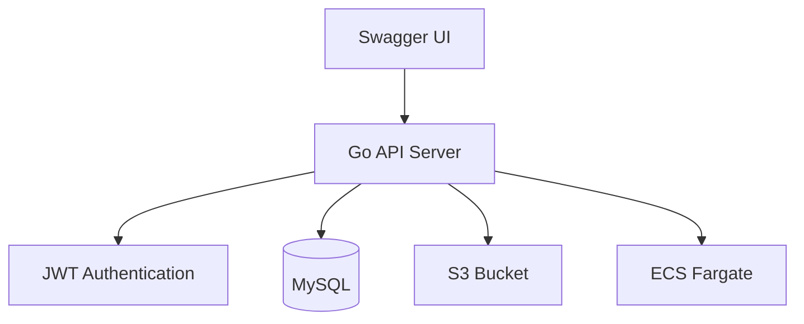
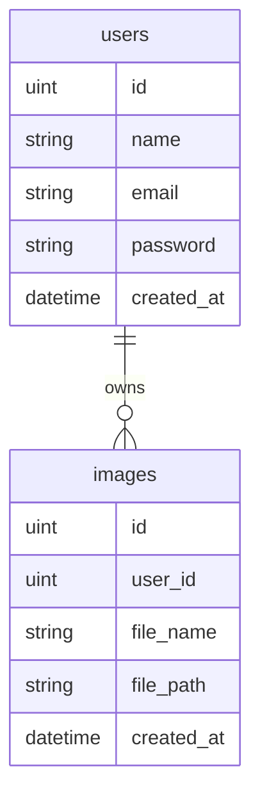

# Go Image API


---

# 概要

JWT認証を利用した画像管理APIです。

ログインしたユーザーのみ、

- 画像アップロード
- 画像一覧取得
- 画像削除

を実行できます。

アップロードされた画像はAWS S3へ保存し、
メタデータはMySQLへ保存しています。

Dockerによるコンテナ化を行い、
AWS ECS(Fargate)上へデプロイしています。

---

# 使用技術

| Category | Technology |
|------------|-------------|
| Language | Go 1.26 |
| Framework | Gin |
| Authentication | JWT |
| Database | MySQL |
| ORM | GORM |
| Storage | Amazon S3 |
| Container | Docker |
| Cloud | ECS(Fargate) |
| Documentation | Swagger |
| Version Control | Git / GitHub |

---

# 主な機能

- ユーザー登録
- JWTログイン
- JWT認証
- S3画像アップロード
- 画像一覧取得
- 画像削除
- Swagger UI
- Dockerコンテナ化
- ECS(Fargate)デプロイ

---

# システム構成図



---

# ER図



---

# API一覧

| Method | Endpoint | Description |
|----------|---------|-------------|
| POST | /register | ユーザー登録 |
| POST | /login | JWT取得 |
| POST | /images | 画像アップロード |
| GET | /images | 画像一覧取得 |
| DELETE | /images/{id} | 画像削除 |

---

# ディレクトリ構成

```text
go-image-api
│
├── cmd
├── config
├── controllers
├── docs
├── dto
├── images
│     ├── swagger.png
│     ├── login.png
│     ├── upload.png
│     ├── get.png
│     └── delete.png
├── middleware
├── models
├── repositories
├── routes
├── services
├── utils
├── Dockerfile
├── docker-compose.yml
├── main.go
└── README.md
```

---

# Swagger UI

## Top


---

# JWTログイン

JWTトークンを発行します。


---

# S3画像アップロード

画像をS3へ保存し、URLをDBへ登録します。


---

# 画像一覧取得

ログインユーザーの画像一覧を取得します。


---

# 画像削除

S3とDBから画像を削除します。


---

# 工夫した点

## レイヤードアーキテクチャ

責務を分離するため、

- controllers
- services
- repositories
- models

に分割し、保守性を高めました。

---

## JWT認証

ログインユーザーのみAPIを利用できるよう実装しました。

---

## UUIDによるファイル名管理

画像名の重複を防ぐため、

```go
uuid.New().String()
```

を利用しています。

---

## Docker化

ローカルと本番環境との差異をなくすため、
Dockerコンテナ化を行いました。

---

## AWS ECS(Fargate)

DockerイメージをECRへPushし、
ECS(Fargate)へデプロイしています。

---

# 苦労した点

AWS ECSからS3へアクセスする際、

- IAMロール
- ECSタスクロール
- S3権限設定
- Dockerイメージ更新
- タスク再デプロイ

など複数の問題が発生しました。

CloudWatchログを確認しながら原因を特定し、
IAMロールやDockerfileの修正によって解決しました。

また、コンテナ更新後に古いイメージが利用される問題があり、

- ECRへの再Push
- ECSの強制デプロイ
- タスク再起動

を行い、正常に反映させました。

AWSインフラ周りの理解を深めることができました。

---

# 開発背景

Go言語とAWSを用いたバックエンド開発および
クラウドデプロイの理解を深めるため、本システムを開発しました。

以下を一通り経験することを目的としています。

- Go
- Gin
- JWT認証
- GORM
- MySQL
- Docker
- AWS S3
- ECS(Fargate)
- Swagger

認証付きREST APIからクラウドデプロイまで、
一連の流れを経験することができました。

---

# 今後の改善点

- Presigned URL対応
- ファイルサイズ制限
- png/jpeg以外のバリデーション
- Pagination実装
- Unit Test追加
- GitHub ActionsによるCI/CD
- CloudFront導入
- Redisキャッシュ導入
- TerraformによるIaC化

---

# 起動方法

## Docker

```bash
docker compose up -d
```

## Swagger

```text
http://localhost:8080/swagger/index.html
```

---

# 学んだこと

本プロジェクトを通じて、

- GoによるREST API開発
- Ginフレームワーク
- JWT認証
- GORM
- Docker
- AWS S3
- ECR
- ECS(Fargate)
- CloudWatch
- Swagger

を利用したバックエンド開発を経験しました。

また、AWS環境で発生した問題をログから調査し、
原因を特定して解決する経験を通じて、

「動くものを作る」だけでなく、
「本番環境で運用する難しさ」

についても学ぶことができました。
