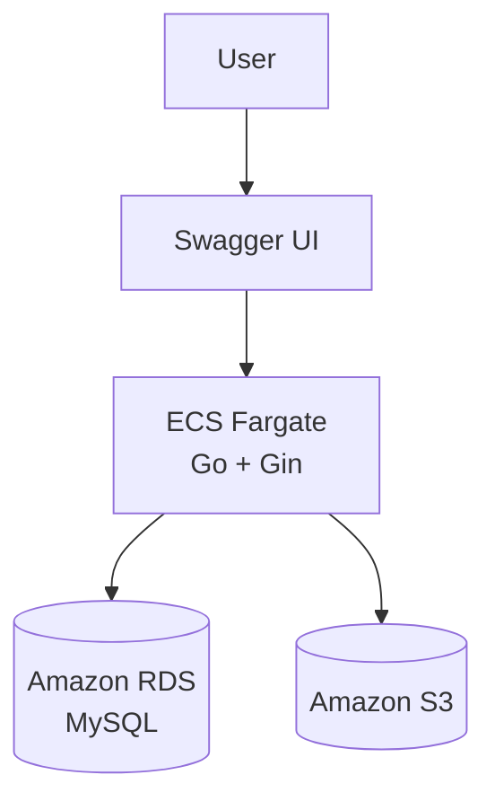
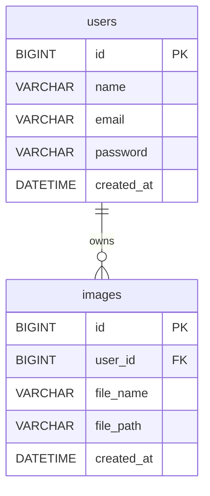

# Go Image API


JWT認証付き画像管理APIです。

ログインしたユーザーごとに画像を管理し、

- AWS S3への画像保存
- Amazon RDS(MySQL)へのメタデータ保存
- ECS(Fargate)へのデプロイ
- SwaggerによるAPIドキュメント

を実装しています。

---

# デモ

Swagger

```
http://xxx.xxx.xxx.xxx:8080/swagger/index.html
```

---

# スクリーンショット

## Swagger


---

## Login


---

## Upload Image


---

## Get Images


---

## Delete Image


---

# 使用技術

| Category | Technology |
|-----------|-----------|
| Language | Go 1.26 |
| Framework | Gin |
| ORM | GORM |
| Authentication | JWT |
| Database | MySQL (Amazon RDS) |
| Storage | Amazon S3 |
| Container | Docker |
| Container Registry | Amazon ECR |
| Compute | Amazon ECS(Fargate) |
| Documentation | Swagger |
| Architecture | Repository Pattern |

---

# AWS構成図



---

# ER図



---

# API一覧

## 認証

### POST /register

ユーザー登録

```json
{
"name":"test",
"email":"test@example.com",
"password":"password123"
}
```

---

### POST /login

JWT取得

```json
{
"email":"test@example.com",
"password":"password123"
}
```

---

## 画像管理

### POST /images

画像アップロード

Authorization: Bearer Token 必須

multipart/form-data

---

### GET /images

ログインユーザーの画像一覧取得

---

### DELETE /images/{id}

画像削除

S3とDBから削除

---

# ディレクトリ構成

```bash
.
├── controllers
├── middleware
├── models
├── repositories
├── routes
├── services
├── docs
├── Dockerfile
├── go.mod
├── main.go
└── README.md
```

---

# 工夫した点

### JWT認証によるユーザー単位の画像管理

ログインユーザーごとに画像を管理できるよう実装しました。

---

### Repository Patternを採用

ControllerとDBアクセス処理を分離し、

- 保守性
- 可読性
- 拡張性

を意識した設計にしました。

---

### IAM Roleを利用した認証情報管理

アクセスキーをソースコードに埋め込まず、

ECS Task RoleからS3へアクセスする構成にしました。

---

### Docker化

ローカル環境と本番環境の差異をなくし、

ECS(Fargate)へそのままデプロイできる構成にしました。

---

### SwaggerによるAPIドキュメント自動生成

API仕様を可視化し、

フロントエンドや他開発者との連携を想定した構成にしました。

---

# 苦労した点

### ECS Task RoleとS3権限周り

アクセスキーを使用せずIAM Roleで認証する構成にしたため、

Task RoleとExecution Roleの違い、

S3への権限設定について理解しながら実装しました。

---

### Docker環境でのCA証明書エラー

S3接続時に

```
x509: certificate signed by unknown authority
```

が発生したため、

Dockerfileに

```
ca-certificates
```

を追加して解決しました。

---

### ECSデプロイ後のパブリックIP変更

新規デプロイのたびにIPアドレスが変わる問題があり、

SwaggerのHost設定を削除して相対パス化することで対応しました。

---

# 今後の改善

- CloudFront導入
- ALB + 独自ドメイン化
- HTTPS化
- GitHub ActionsによるCI/CD
- ページネーション
- サムネイル生成
- 画像圧縮
- 画像検索機能
- Redisによるキャッシュ
- CloudWatch Logsの整備

---

# 学習ポイント

- Go(Gin)によるREST API開発
- JWT認証
- Repository Pattern
- Docker
- Amazon ECS(Fargate)
- Amazon ECR
- Amazon S3
- Amazon RDS(MySQL)
- IAM Role
- Swagger

---

# Author

Yu Iwamoto

GitHub

https://github.com/xxxxxxxx/go-image-api
